# Suspicious PowerShell Execution Detection and Investigation

## Objective

Detect and investigate suspicious PowerShell execution using Security Onion, Windows process-creation telemetry, a custom Sigma rule, CyberChef, and MITRE ATT&CK.

The goal of this project is to simulate controlled encoded PowerShell activity on a Windows endpoint, create and validate a detection for suspicious PowerShell command-line parameters, reconstruct the process tree from Windows Event ID `4688`, decode the Base64 payload, identify child-process activity, map the observed behavior to MITRE ATT&CK, and document the investigation from a SOC analyst perspective.

## Lab Environment

* Windows 10 — target endpoint and controlled activity source
* Security Onion 3.2.0 — monitoring, detection, and investigation platform
* Windows Security Event Log — process-creation telemetry using Event ID `4688`
* Sigma / ElastAlert — custom detection logic and alert generation
* CyberChef — Base64 decoding and payload analysis
* MITRE ATT&CK — behavior classification and technique mapping
* VirtualBox — isolated lab environment

## Lab Topology

The investigation was performed inside an isolated VirtualBox environment. The Windows 10 endpoint generated process-creation telemetry that was ingested by Security Onion. Security Onion applied the custom Sigma rule to the collected process data, while CyberChef and MITRE ATT&CK were used during the investigation and analysis stages.

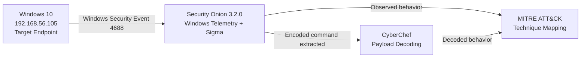

## Scenario

A SOC analyst receives a high-severity alert for suspicious PowerShell execution on the Windows endpoint `Victim`.

The PowerShell command line contains both `-ExecutionPolicy Bypass` and `-EncodedCommand`, which are legitimate PowerShell features but are also commonly associated with attempts to execute hidden or obfuscated commands.

The objective of the investigation is to determine:

- what command caused the alert
- which process launched the suspicious PowerShell instance
- what the encoded payload contains
- whether the PowerShell process created additional child processes
- what actions those child processes performed
- which MITRE ATT&CK techniques describe the observed behavior
- how a SOC analyst should respond if the same activity appeared on a real endpoint

## Activity Simulation

A controlled PowerShell payload was created on the Windows endpoint.

```powershell
$payload = 'whoami | Out-File C:\Users\Public\soc-lab-user.txt; Start-Process cmd.exe -ArgumentList "/c echo SOC-LAB > C:\Users\Public\soc-lab-child.txt"'
$encoded = [Convert]::ToBase64String([Text.Encoding]::Unicode.GetBytes($payload))
powershell.exe -NoProfile -ExecutionPolicy Bypass -EncodedCommand $encoded
```

### Command Breakdown

- `$payload` — stores the PowerShell commands that will be encoded
- `whoami` — identifies the security context under which the payload executes
- `Out-File` — writes the `whoami` result to `C:\Users\Public\soc-lab-user.txt`
- `Start-Process cmd.exe` — creates a Windows Command Shell child process
- `echo SOC-LAB` — writes a controlled marker to `C:\Users\Public\soc-lab-child.txt`
- `[Convert]::ToBase64String(...)` — converts the payload to Base64 using the UTF-16LE encoding expected by Windows PowerShell `-EncodedCommand`
- `-NoProfile` — starts PowerShell without loading the user's PowerShell profile
- `-ExecutionPolicy Bypass` — runs the process without enforcing the normal execution-policy restrictions for that process
- `-EncodedCommand` — supplies the command as an encoded string instead of clear text on the command line

The payload was intentionally harmless and was used only to create observable process activity inside the isolated lab.

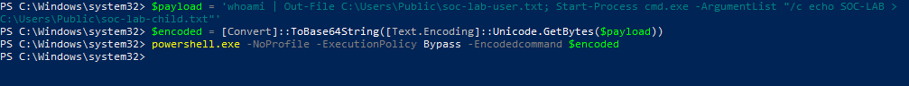

## Detection Engineering

### Custom Sigma Detection

A custom Sigma rule was created in Security Onion to detect PowerShell process creation containing either an encoded command or execution-policy bypass parameter.

```yaml
title: Suspicious PowerShell Encoded Command or Execution Policy Bypass
id: 8e6b36a5-4371-4f60-8f44-5c6ac21d86e1
status: experimental
description: Detects PowerShell process creation using encoded commands or execution policy bypass parameters.
author: Pedro Fontao
date: 2026-09-20

logsource:
  category: process_creation
  product: windows

detection:
  selection_image:
    Image|endswith:
      - '\powershell.exe'
  selection_suspicious:
    CommandLine|contains:
      - '-EncodedCommand'
      - '-ExecutionPolicy Bypass'
  condition: selection_image and selection_suspicious

falsepositives:
  - Legitimate administrative PowerShell activity

level: high

tags:
  - attack.execution
  - attack.t1059.001
```

The detection is intentionally broad enough to identify suspicious PowerShell execution patterns but includes legitimate administrative PowerShell activity as a possible false-positive source. This means the alert requires investigation rather than being treated as proof of malicious activity by itself.

### Sigma Alert

After the controlled payload was executed, Security Onion generated a high-severity alert named:

`Suspicious PowerShell Encoded Command or Execution Policy Bypass`

The alert confirmed that the custom rule successfully matched the PowerShell activity.

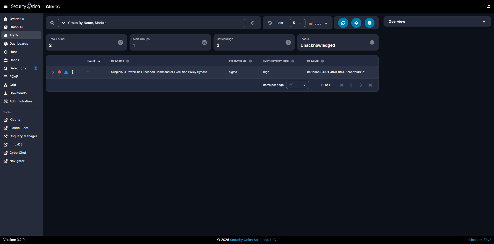

Security Onion produced two alerts for the same controlled execution because the behavior was visible through two telemetry datasets:

- `system.security`
- `endpoint.events.process`

This provided corroborating process telemetry, although in a production environment the duplicate detections would need to be considered during alert correlation and deduplication.

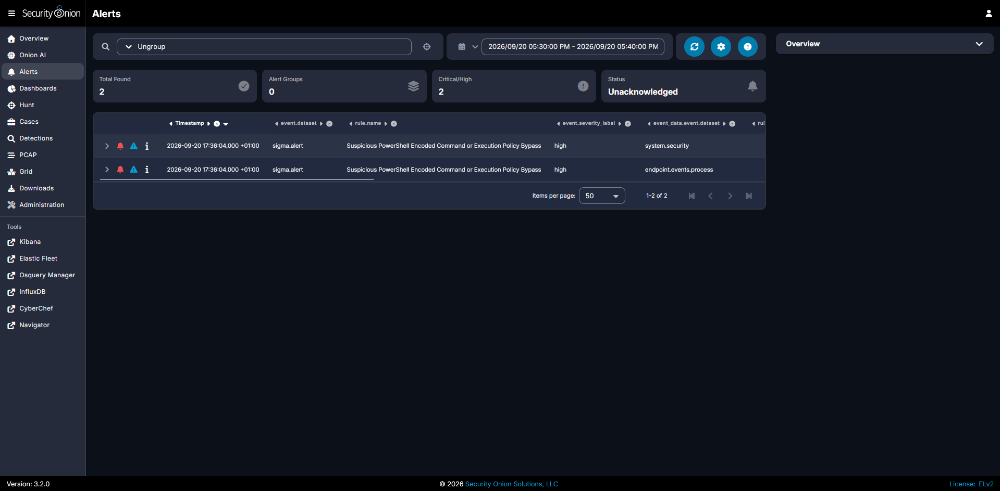

## Investigation

### Suspicious PowerShell Process

The underlying Windows process-creation event was inspected in Security Onion.

The event showed:

- Windows Event ID: `4688`
- endpoint: `Victim`
- process: `powershell.exe`
- process PID: `1196`
- creator / parent PID: `7396`
- user: `admin`
- command-line parameters included `-NoProfile`, `-ExecutionPolicy Bypass`, and `-EncodedCommand`

The event also preserved the full Base64 string supplied to `-EncodedCommand`, which made it possible to recover and inspect the original payload.

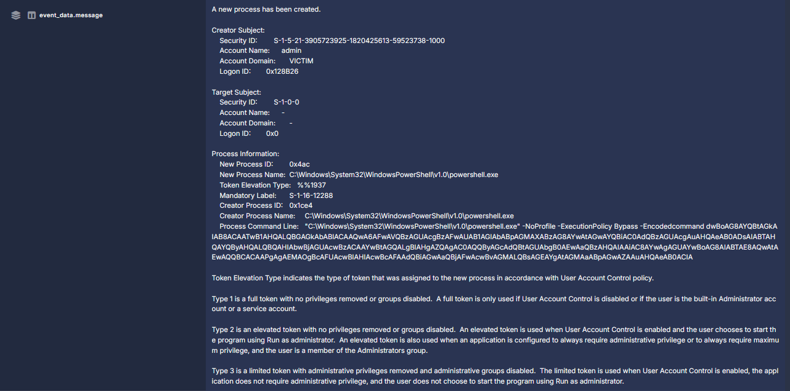

### Parent Process Analysis

To understand how the suspicious PowerShell instance was reached, the parent PowerShell process was investigated separately.

Security Onion showed that PID `7396` was itself a `powershell.exe` process and that its parent was `explorer.exe`.

This established the beginning of the process lineage used in the investigation:

```text
explorer.exe
    └── powershell.exe (PID 7396)
            └── powershell.exe (PID 1196, encoded command)
```

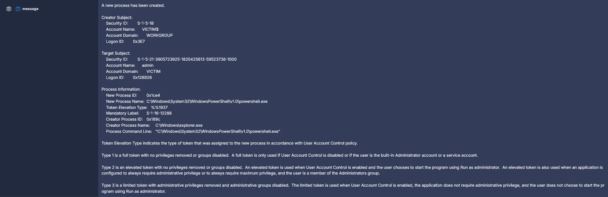

### Child Process Discovery

The suspicious PowerShell PID `1196` was then used as the parent-process identifier in Security Onion Hunt.

Query used:

```text
agent.name:"Victim" AND event.dataset:system.security AND event.code:4688 AND process.parent.pid:1196
```

Two child processes were identified:

| Process | PID | Parent PID |
|---|---:|---:|
| `whoami.exe` | `7780` | `1196` |
| `cmd.exe` | `9844` | `1196` |

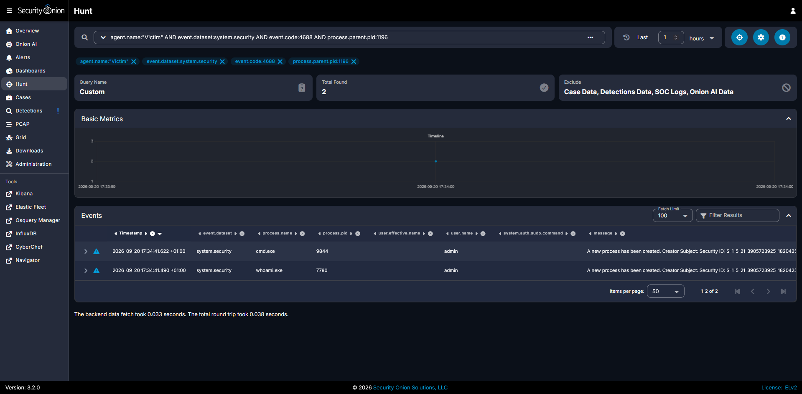

This was important because the alert identified the suspicious PowerShell command, while process-tree analysis showed what the command actually caused the endpoint to execute.

### CMD Child Process Analysis

The `cmd.exe` child process was inspected in detail.

Its process-creation event showed:

```text
C:\Windows\system32\cmd.exe /c echo SOC-LAB > C:\Users\Public\soc-lab-child.txt
```

The event confirmed that:

- `cmd.exe` was launched by `powershell.exe`
- its parent PID was `1196`
- it executed the controlled `echo SOC-LAB` command
- output was redirected to `C:\Users\Public\soc-lab-child.txt`

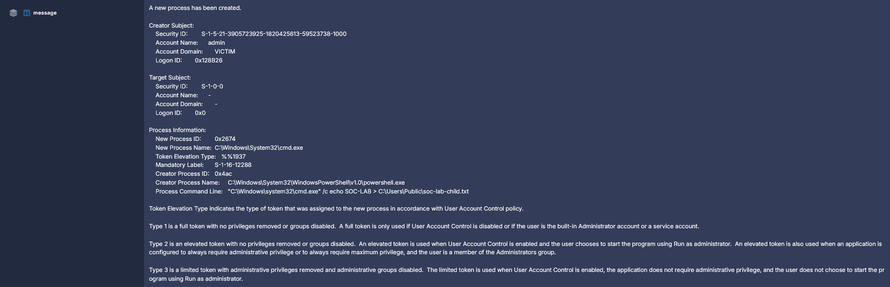

### WHOAMI Child Process Analysis

The second child process was `whoami.exe`.

Security Onion showed that:

- `whoami.exe` had PID `7780`
- its parent process was `powershell.exe`
- its parent PID was `1196`
- the process executed under the `admin` user context

The decoded payload showed that the result of `whoami` was redirected to `C:\Users\Public\soc-lab-user.txt`.

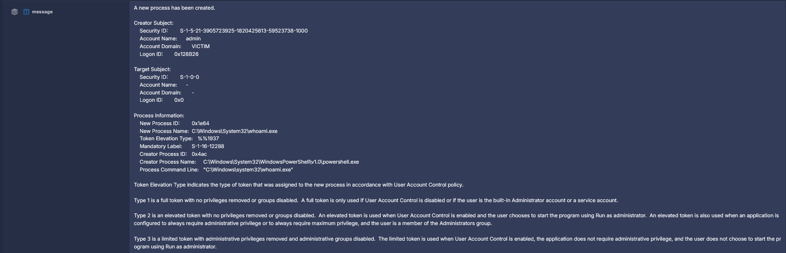

### Reconstructed Process Tree

Combining the parent and child process telemetry produced the following process tree:

```text
explorer.exe
└── powershell.exe (PID 7396)
    └── powershell.exe (PID 1196)
        ├── whoami.exe (PID 7780)
        └── cmd.exe (PID 9844)
```

The process tree showed that the suspicious encoded PowerShell process was not an isolated event. It created two additional processes that matched the behavior found after decoding the payload.

## Payload Decoding with CyberChef

The Base64 value from the suspicious PowerShell command line was extracted and analyzed with CyberChef.

Because Windows PowerShell's `-EncodedCommand` uses UTF-16LE text encoding, the CyberChef recipe used:

1. `From Base64`
2. `Decode text` as `UTF-16LE`

The decoded payload was:

```powershell
whoami | Out-File C:\Users\Public\soc-lab-user.txt; Start-Process cmd.exe -ArgumentList "/c echo SOC-LAB > C:\Users\Public\soc-lab-child.txt"
```

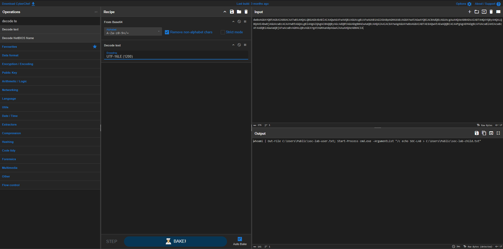

The decoded command directly explained the child-process telemetry seen in Security Onion:

- `whoami` corresponded to `whoami.exe` PID `7780`
- `Start-Process cmd.exe` corresponded to `cmd.exe` PID `9844`
- the CMD command line matched the `SOC-LAB` file-write operation observed in the Event ID `4688` data

This correlation converted an opaque encoded command into a clear explanation of the endpoint behavior.

## Incident Timeline

All times below are shown using the Security Onion interface time zone (`+01:00`).

| Time | Event |
|---|---|
| 17:28:17.134 | `explorer.exe` launched PowerShell PID `7396`. |
| 17:34:39.220 | PowerShell PID `7396` launched PowerShell PID `1196` with `-ExecutionPolicy Bypass` and `-EncodedCommand`. |
| 17:34:41.490 | Suspicious PowerShell PID `1196` launched `whoami.exe` PID `7780`. |
| 17:34:41.622 | Suspicious PowerShell PID `1196` launched `cmd.exe` PID `9844`, which executed the controlled `SOC-LAB` file-write command. |
| 17:36:04.000 | Security Onion generated high-severity Sigma alerts for the suspicious PowerShell execution. |

The alert was generated approximately 85 seconds after the underlying suspicious process-creation event. This illustrates the difference between event occurrence time and alert-generation time in a SIEM detection pipeline.

## Indicators and Observables

| Type | Value | Role |
|---|---|---|
| Endpoint | `Victim` | Windows endpoint where the controlled activity executed |
| Host-only Lab IP | `192.168.56.105` | Host-only lab IP observed in endpoint telemetry |
| Windows Event ID | `4688` | New process creation |
| Suspicious Process | `powershell.exe` | Process matched by the custom Sigma detection |
| Suspicious PID | `1196` | Encoded PowerShell process under investigation |
| Parent Process | `powershell.exe` | Process that launched PID `1196` |
| Parent PID | `7396` | Parent of the suspicious PowerShell process |
| Grandparent Process | `explorer.exe` | Parent of PowerShell PID `7396` |
| Child Process | `whoami.exe` | User-context discovery executed by the payload |
| Child PID | `7780` | PID assigned to `whoami.exe` |
| Child Process | `cmd.exe` | Windows Command Shell launched by the payload |
| Child PID | `9844` | PID assigned to `cmd.exe` |
| Output File | `C:\Users\Public\soc-lab-user.txt` | File receiving the `whoami` output |
| Output File | `C:\Users\Public\soc-lab-child.txt` | File receiving the controlled `SOC-LAB` marker |
| Detection Rule | `Suspicious PowerShell Encoded Command or Execution Policy Bypass` | Custom Sigma rule |
| Rule UUID | `8e6b36a5-4371-4f60-8f44-5c6ac21d86e1` | Identifier for the custom detection |
| Severity | `high` | Sigma alert severity |

## MITRE ATT&CK Mapping

### T1059.001 — Command and Scripting Interpreter: PowerShell

The primary execution behavior maps to **T1059.001 — PowerShell**.

Evidence supporting this mapping:

- `powershell.exe` was the process executing the controlled payload
- the suspicious process used PowerShell-specific command-line parameters
- the payload used PowerShell functionality such as `Out-File` and `Start-Process`
- Security Onion captured the PowerShell process creation through Windows Event ID `4688`

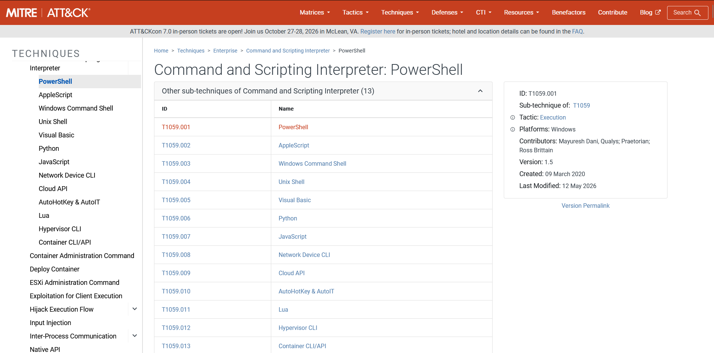

### T1059.003 — Command and Scripting Interpreter: Windows Command Shell

The payload also maps to **T1059.003 — Windows Command Shell** because PowerShell launched `cmd.exe` to execute an additional command.

Evidence supporting this mapping:

- `cmd.exe` was created as a child of suspicious PowerShell PID `1196`
- Event ID `4688` captured the full CMD command line
- the child shell executed `echo SOC-LAB` and redirected the output to a file

### T1027.010 — Obfuscated Files or Information: Command Obfuscation

The encoded PowerShell execution maps to **T1027.010 — Command Obfuscation**.

Evidence supporting this mapping:

- the command content was not supplied directly in clear text
- the payload was converted to Base64 before execution
- PowerShell executed the Base64 string through `-EncodedCommand`
- CyberChef was required to recover the original readable command from the telemetry

Base64 is encoding rather than encryption, but encoding can still be used to obscure command content from casual inspection and simple string-based detection.

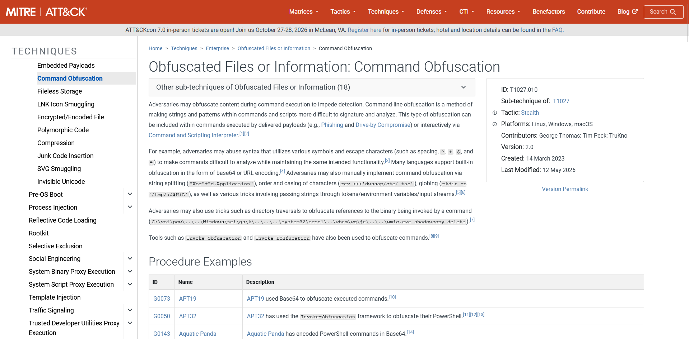

## Findings and Analyst Verdict

The investigation confirmed that the alert was a **true positive** for the behavior described by the detection rule: PowerShell genuinely executed with suspicious command-line parameters inside the lab.

Key findings:

- a custom Sigma rule successfully detected PowerShell execution containing suspicious command-line parameters
- the suspicious PowerShell process was recorded as Windows Event ID `4688`
- the encoded process was PID `1196` and was launched by PowerShell PID `7396`
- the parent PowerShell process was traced back to `explorer.exe`
- the Base64 payload was successfully extracted from the process command line and decoded with CyberChef
- the decoded payload executed `whoami` and launched `cmd.exe`
- Security Onion independently showed both child processes with parent PID `1196`
- the CMD process command line matched the action recovered from the decoded payload
- the behavior mapped to MITRE ATT&CK `T1059.001`, `T1059.003`, and `T1027.010`
- Security Onion generated alerts from both `system.security` and `endpoint.events.process` telemetry for the same controlled execution

Because this activity was intentionally generated inside the isolated lab, the decoded payload was known to be benign. In a real SOC environment, however, the combination of encoded PowerShell, execution-policy bypass, and follow-on child-process creation would justify investigation until the user, parent process, payload, and business context were validated.

The presence of `-EncodedCommand` or `-ExecutionPolicy Bypass` alone does not prove malicious activity. Administrative scripts and legitimate automation can use the same PowerShell features, so the detection should be treated as a strong investigation lead rather than a standalone compromise verdict.

## Recommendations and Remediation

In a real environment, the following actions would be appropriate:

- identify the user, endpoint owner, and business context associated with the PowerShell execution
- verify whether the parent process and initiating application are expected for that user and system
- extract and decode any `-EncodedCommand` content before making a disposition
- reconstruct the full process tree and inspect all child and descendant processes
- review PowerShell Operational logs, including Script Block Logging where available, for additional command content
- examine files created or modified by the process and determine whether they are expected
- review endpoint telemetry for network connections, persistence activity, credential access, privilege escalation, or additional command execution near the same timestamp
- correlate Windows Security process events with endpoint telemetry to strengthen confidence in the process lineage
- if the activity is unauthorized, isolate the endpoint as appropriate and preserve relevant evidence for deeper investigation
- terminate malicious processes and remove confirmed malicious artifacts only after sufficient evidence has been collected
- review the affected user's credentials and sessions if credential theft or account compromise is suspected
- tune or allowlist the Sigma rule only for well-understood legitimate administrative activity rather than broadly suppressing encoded PowerShell
- consider alert correlation or deduplication when equivalent detections are generated from multiple telemetry datasets for the same execution

The custom rule depends on process-creation telemetry containing both the process image and command line. If command-line auditing or endpoint process telemetry is unavailable, the same activity may be harder to detect or investigate.

## What I Learned

<!-- Write this section yourself. -->
